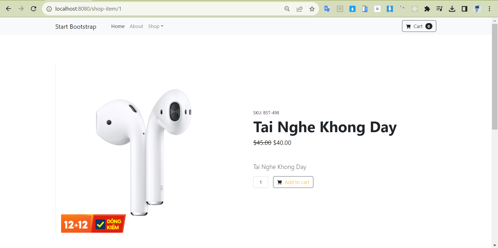
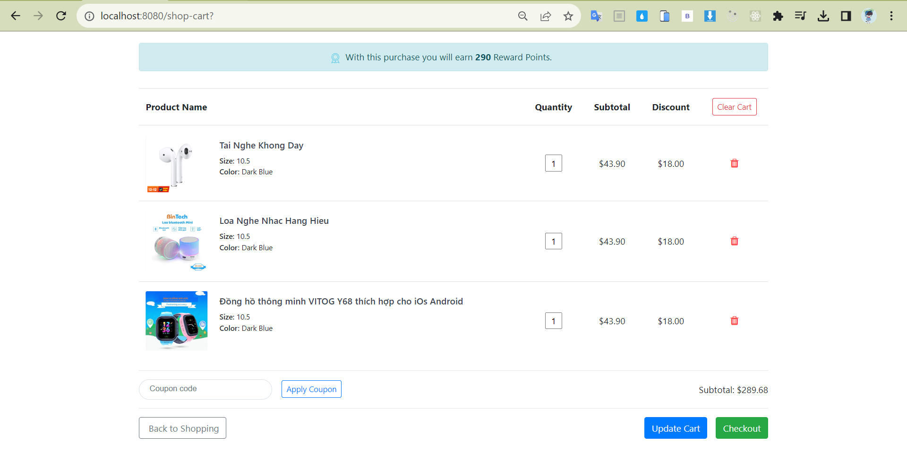
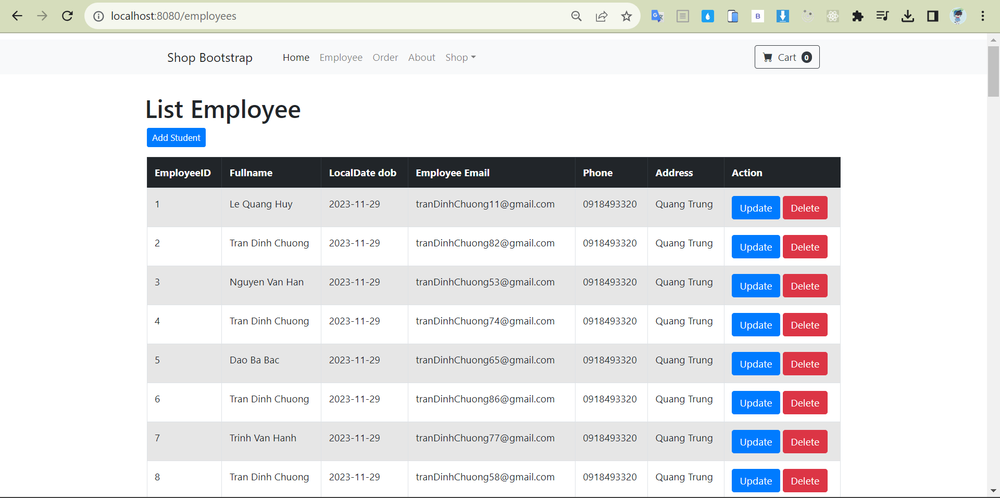
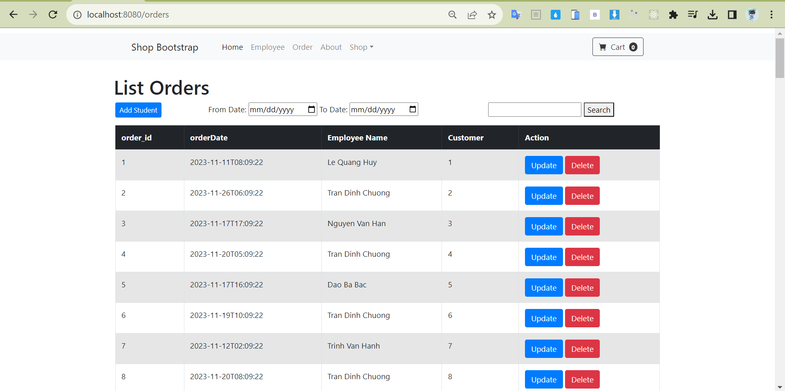

# Tuan7_WWW
# Ứng dụng web cho công việc bán hàng của họ
## Dự án sử dụng SpringBoot thực hiện :
- Hiển thị các sản phẩm, chọn vào giỏ hàng và thanh toán
- Một trang admin cho phép:
+ Các thao tác CRUD cho các đối tượng.
+ Thống kê order theo ngày, theo khoảng thời gian.
+ Thống kê order theo nhân viên bán hàng trong 1 khoảng thời gian.
### Trang chủ 

### Trang chủ chi tiết sản phẩm 

### Giỏ Hàng

### Các thao tác CRUD cho các đối tượng Employee

### Thống kê order theo nhân viên bán hàng.Thống kê order theo ngày, theo khoảng thời gian.

